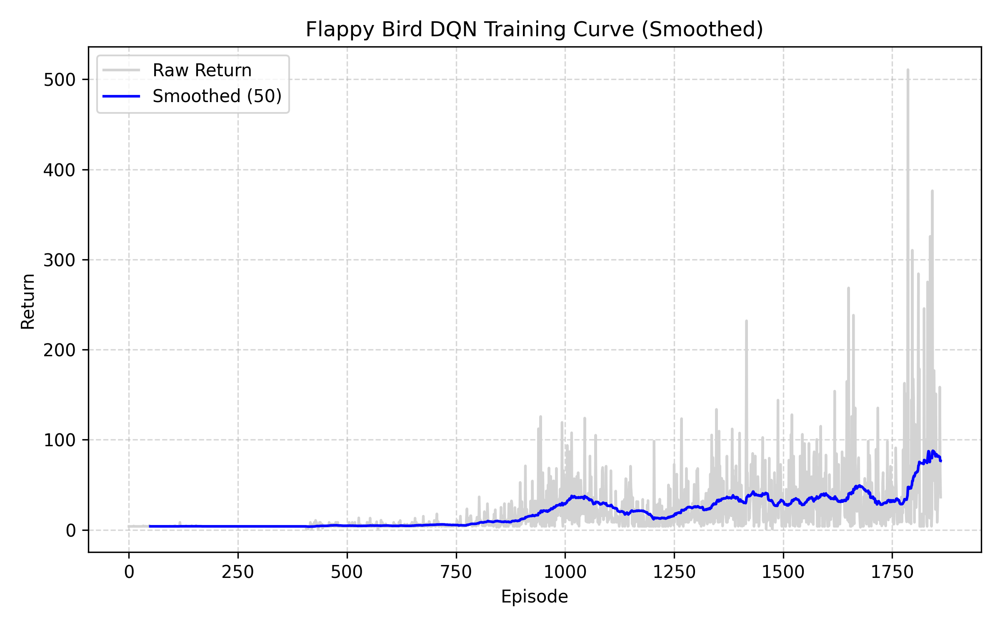

##  Overview
- This project implements a **Deep Q-Network (DQN)** agent to play *Flappy Bird*.  
- The game environment and parameters are adapted from [yenchenlin/DeepLearningFlappyBird](https://github.com/yenchenlin DeepLearningFlappyBird), with several modifications for modern PyTorch compatibility and more stable training.
- The core DQN training framework is based on *Hands-on Reinforcement Learning (动手学强化学习)*, with adjustments to fit the Flappy Bird environment

## Training Performance
- 

## Demo
- Specific training demonstrations can be viewed at this link: https://www.bilibili.com/video/BV1pq4YznEB6/?spm_id_from=333.1387.homepage.video_card.click&vd_source=03153dc298add80c6d4d655915ec7cd2

##  References
- **Mnih, V., Kavukcuoglu, K., Silver, D., et al. (2015).**  
  *Human-level control through deep reinforcement learning.*  
  **Nature, 518**, 529–533.  
  [[Paper]](https://www.nature.com/articles/nature14236) [[arXiv]](https://arxiv.org/abs/1312.5602)

- **Game environment:** adapted from [yenchenlin/DeepLearningFlappyBird](https://github.com/yenchenlin/DeepLearningFlappyBird)
- **DQN implementation framework:** based on *《动手学强化学习》* (Hands-on Reinforcement Learning)
